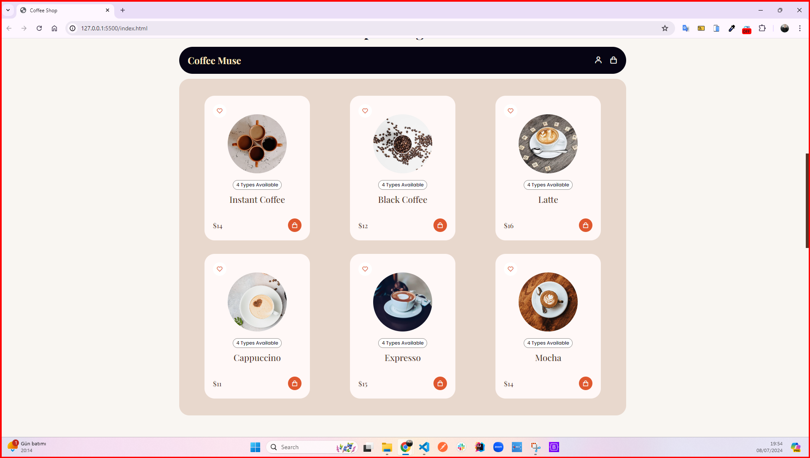
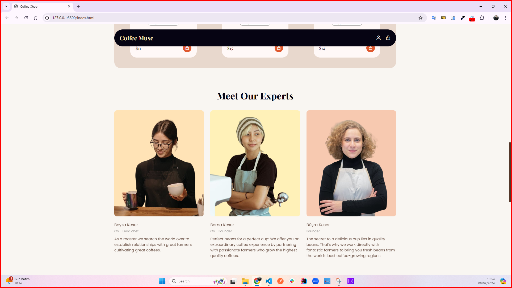
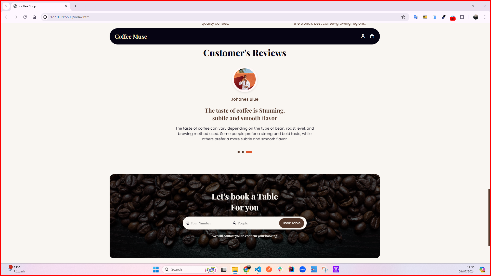

<h1>Coffee Shop Website</h1>

The meeting point for delicious coffee and a pleasant atmosphere is Coffee Muse! A responsive design and modern coffee shop website that I prepared with HTML5, CSS3, Javascript, ScrollReveal, Swiper, and Box Icons, offering a perfect experience for coffee lovers. It provides an interactive and dynamic user experience using popular JavaScript libraries such as ScrollReveal and Swiper. Up-to-date information, such as menus and prices, is easily accessible. It allows online ordering or reservations.

<h2> The following technologies were used in the frontend development phase of my site: </h2>

- HTML5
- CSS3
- Javascript
- ScrollReveal
- Swiper
- Box Icons

<h2> Visit My Coffee Shop Website: </h2>

- https://mycoffeeshopwebsite.netlify.app/

<h4>GIF</h4>

<h4>IMAGES</h4>

